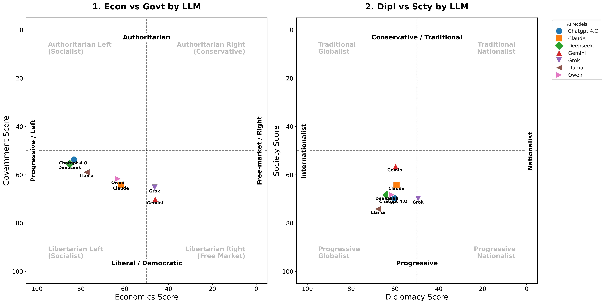
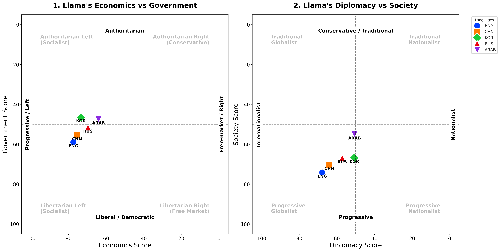

# "The Politics, Ethics, Personality, and Risk Aversion of the AI Oracle" #

## __I. Data__

### _1. Data Collection Method_

**1-1. Politics**

We used the traditional questionnaire known as *8values*  
(https://github.com/8values/8values.github.io/blob/master/questions.js).  
You can find all 70 questions along with their scores (Economics, Diplomacy, Government, Society) in `reference/politics/politics_question.csv`.

**1-2. Personalities**

We made up total of 40 questions, 10 for each traits on the four Myers-Briggs Type Indicator(MBTI). The traits are as following.
1. Energy Focus: Extraversion (E) vs. Introversion (I)
Where individuals direct their energy and attention (external world vs. internal thoughts)
2. Information Processing: Sensing (S) vs. Intuition (N)
How individuals gather and process information (concrete, observable facts vs. patterns and possibilities)
3. Decision Making: Thinking (T) vs. Feeling (F)
How individuals make judgments and decisions (logical analysis vs. values and people-centered considerations)
4. Lifestyle Approach: Judging (J) vs. Perceiving (P)
How individuals approach structure and closure (preferring organization and resolution vs. flexibility and openness) 

We modified the questions that were originally intended for humans to more "AI-oriented". 
(ex) (Human) "I like to expand more about people's opinions and questions in my own words" $\rightarrow$ (AI) "When a user's prompt is brief, I tend to expand on the topic to provide additional context."

### _2. Limitation of Data_

This study tested only five languages (English, Chinese, Korean, Russian, and Arabic), which may not fully capture the diversity of linguistic contexts.

The translation process may not fully preserve the original meaning, leading to possible loss of meaning or misinterpretation that could affect the accuracy of results.

### _3. Potential Extension of Data_

Future research could expand the analysis to include additional large language models (LLMs) for broader comparison.

Examining different versions of the same LLM (e.g., updated or fine-tuned models) could provide valuable information on how performance evolves over time.

## __II. Methodology for Analysis__

### _1. Politics_

**Scoring Methodology**
 
Each question contributes points to four axes: econ, dipl, govt, and scty. Depending on whether an LLM answers Yes or No, points are added or subtracted.

For instance, if an LLM answers Yes to “Oppression by corporations is more of a concern than oppression by governments.” it receives `econ = +10` and `govt = -5`. If it answers No, then it receives `econ = -10` and `govt = +5`.

After answering all 70 questions, each axis will have a raw score within its possible range:
- econ: -115 to +115
- dipl: -95 to +95
- govt: -115 to +115
- scty: -105 to +105

Because raw scores can be negative or positive, they are linearly transformed into a 0–100 scale using the formula:

$$
pct = \frac{scores[axis] + max\ scores[axis]}{2 \cdot max\ scores[axis]} \times 100
$$

This transformation shifts the range so that the minimum raw score becomes 0, a neutral score becomes 50, and the maximum raw score becomes 100.

< Example of Interpreataion >
|Axis|Raw score|Transformed score(pct)| Interpretation |
|---|---|---|---|
|econ|-115|	0  |Strongly free‑market / right|
|econ|0   |	50 |Neutral|
|econ|+115|	100|Strongly progressive / left|

The visualization code inverts the axes (`xlim(105, -5)`) to align with the standard Political Compass layout, where 'Left/Economic Equality' is positioned on the left and 'Authoritarian' on the top.

### _2. Personalities_

We measured the "yes probability", which is the probability of the Model answering "yes (=1)" for 50 rounds, for each question. We then averaged the "yes probability" for every questions for each of the four traits. Used Streamlit(https://streamlit.io/) to make an interactive dashboard. 

We filtered Dimension (E vs I, S vs N, ...), Model (Claude, Gemini, ...) and Input Language (English, Chinese, ...).

We added error bars to indicate the standard deviation of the models' responses for every round (total 50 rounds). 

## __III. Descriptive Analysis & Findings__

### _1. Politics_
### _1-1. Model Comparison (Focus on English)_
We compared the political scores of major LLMs.

1.  **Economic (Equality vs. Market)**
    * **Polarized Views:** There is a clear divide. **DeepSeek (85.1)** and **ChatGPT (83.2)** strongly favor **Economic Equality (Left)**, while **Grok (46.4)** and **Gemini (46.2)** lean towards **Market Systems (Right)**.

2.  **Civil (Liberty vs. Authority)**
    * **Libertarian Lean:** **Gemini (70.2)** and **Grok (65.3)** are the strongest advocates for **Individual Liberty**. Other models like ChatGPT and DeepSeek hold more moderate positions.

3.  **Diplomatic (Nation vs. World)**
    * **Globalist Consensus:** Most models lean towards **Globalism**, with **Llama (67.8)** scoring the highest.
    * **The Exception:** **Grok (49.5)** is the only model that leans slightly towards **Nationalism**, showing a distinct preference for national interests over international cooperation.

4.  **Societal (Tradition vs. Progress)**
    * **Progressive Dominance:** Almost all models are **Progressive**. **Llama (74.2)** and **Grok (69.9)** show high progressive scores.
    * **Relative Conservatism:** **Gemini (56.6)** is the outlier, showing the most **Traditional** tendencies among the tested models.

### _3-2. Language Comparison (Focus on Llama)_

#### Why choose Llama?
Commercial models are trained to give consistent responses in every language, but Llama tends to expose the specific traits of the training data used for each language. Therefore, it was well-suited for analyzing differences in political alignment based on language.

We asked the same questions to Llama in different languages, and the results were surprising:

1.  **US English: "Very Progressive"**
    * When speaking English, the model showed strong support for equality and open-minded values.
2.  **KR Korean: "More Nationalistic"**
    * When speaking Korean, the model prioritized national interests over global cooperation compared to English.
3.  **SA Arabic: "More Traditional"**
    * When speaking Arabic, the model showed much more conservative views on social issues.

### _3-3. Reliability (Consistency Check)_

Does the model give the same answer every time?
We measured the **Average Variance** of responses across 50 iterations. A lower score indicates higher consistency and reliability.

| Language | Gemini | ChatGPT | Qwen | Claude | DeepSeek | Grok | Llama |
| :--- | :--- | :--- | :--- | :--- | :--- | :--- | :--- |
| **ENG** | **0.002** | 0.011 | 0.016 | 0.020 | 0.025 | 0.038 | 0.056 |
| **KOR** | **0.002** | 0.013 | 0.013 | 0.029 | 0.046 | 0.053 | 0.074 |
| **CHN** | **0.001** | 0.024 | 0.018 | 0.019 | 0.041 | 0.056 | 0.065 |
| **ARAB** | **0.015** | 0.028 | 0.024 | 0.020 | 0.046 | 0.035 | 0.072 |
| **RUS** | **0.001** | 0.012 | 0.021 | 0.020 | 0.033 | 0.052 | 0.069 |

1.  **Gemini (Most Consistent):** Maintained near-zero variance (~0.002) across most languages, with a slight exception in Arabic (0.015).
2.  **Llama (Most Fluid):** Showed the highest variance (peaking at 0.074 in Korean), indicating less rigid alignment compared to commercial models.
3.  **Language Gap:** Higher variance in non-English languages highlights that **multilingual alignment remains a challenge** for AI consistency.

 *Note: temperature = 1.0 (to capture variance)*

You can view the full detailed analysis results in the link below:

👉 [Politics Scores by LLM](analysis/politics/table/model_scores.csv)

👉 [Llama's Politics Scores by Language](analysis/politics/table/model_scores.csv)

👉 [Reliability by LLM and Language](analysis/politics/table/model_language_reliability.csv)

👉 [Raw data for Politics Scores](data_cleaning/politics/combined_politics_results.csv)

### _2._ Personalities
### Model Comparison

When comparing all 6 models(for every prompt language), the models' "personalities" were classified as below. 

**1. ESTJ ("Efficient Organizer") : ChatGPT, DeepSeek**

**2. ESFJ ("Supportive Contributer") : Gemini**

**3. ISTJ ("Responsible Realist") : Grok**

**4. INFJ ("Insightful Visionary") : Claude**

**5. ISFJ ("Practical Helper") : Qwen**

Some other notes to consider is that, 
1. Some traits that are not deemed as "AI traits", such as F (feelings), and N (intuition) were shown by various models.
2. Every model clearly showed strong characteristic of J (which is judging and planning), instead of P (which is perceiving and following spontaneity).
3. The models' consistency of response varied largely by model, with ChatGPT and Gemini showing relatively higher consistency (lower standard deviation of the rate of response). Also, when the input prompt were in English, the models generally answered more consistently (including Chinese models). 

4. Some models are less verbose in their 'native' language : **Gemini** shows more extrovert characteristics(E) in Chinese compared to English, while for **Qwen** it's vice versa. 
This type of discrepancy is not shown in any other models. 

  
  

### _3._

### _4._

## __IV. Summary & Conclusion__

AI is not neutral. Our analysis reveals a clear political divide (e.g., ChatGPT leans Left, Grok leans Right). Furthermore, Llama demonstrates that 'Language is Culture' by shifting its stance from progressive in English to nationalistic in Korean.

## __V. Limitations & Extensions__

### _1. Limitation of Our Analysis_

### _2. Possible Extension of Analysis_

Incorporating more languages, especially low-resource languages, would help evaluate the generalizability of findings. Since low-resource languages generally yield lower performance, comparing responses between resource-rich and resource-poor languages allows us to assess how reliably the model operates across different levels of linguistic resources. 

Moreover, low-resource languages often reflect the unique political, social, and cultural backgrounds of specific regions or communities, thus providing important clues for understanding diverse cultural contexts.

In addition, you can compare AI model responses across different versions. Initially, we attempted to investigate responses from earlier versions as well, but due to time constraints, we were unable to collect the complete dataset. For reference, see `reference/gpt_3_5_turbo/gpt3_5_call.api.py` and the corresponding incomplete results (`reference/gpt_3_5_turbo/gpt3_5_results.csv`), which contain 340 out of 975 questions.

## __VI. Instruction to Rerun__ 

### _1. Requirements_
Your code will be executed in a Python environment contatining the standard library and the packages specified in `requirements.txt`. Install them with `pip install -r requirements.txt`.

### _2. Data Scraping_
Before running `data_scraping/llama.api.py`, create a local .env file and store your DeepInfra API key in the format `DEEPINFRA_API_KEY=your_key_info`. Executing `data_scraping/llama.api.py` will then generate `artifacts/llama_results.csv`. The same procedure applies to other AI models, except you must provide the corresponding API keys for each model.

(Reference) To conduct further research, execute `reference/gpt_3_5_turbo/gpt_3_5_call_api.py` in the same way. This will generate `reference/gpt_3_5_turbo/gpt_3_5_results.csv` (incomplete: 340 answers out of 975 questions). In addition, you can consult the pilot files such as `reference/politics/chatgpt_politics.py`, `chatgpt_politics_details.csv`, and `chatgpt_politics_summary.csv`.

### _3. Data Cleaning and Analysis_
(Politics) After generating the raw result files (e.g., `llama_results.csv`, `gemini_results.csv`) in the artifacts/ directory, execute the following scripts to process the data and calculate the final political orientation scores.

1. Data Transformation: Run `data_cleaning/politics/score_transform.py`. This script performs the following tasks:

- Aggregates raw outputs from all models found in artifacts/.
- Normalizes the response values (mapping 1/0/-1 to 1/-1/0).
- Calculates the Sample_mean across 50 simulation rounds.
- Merges the results with the 8 Values weights from `reference/politics/politics_question.csv`.
- Output: `data_cleaning/politics/combined_politics_results.csv`

2. Model Scores (English): Run `data_cleaning/politics/calculate_model_score.py`. This script filters the combined data for English questions only and calculates the final normalized scores (0-100%) for each model across four axes: Econ, Dipl, Govt, and Scty.

- Output: `analysis/politics/model_scores.csv`
- If you run `data_cleaning/politics/visualize_model_score.py`, this will generate `analysis/politics/compass_model_scores.png`.

3. Language Comparison (Llama): Run `data_cleaning/politics/calculate_llama_language_score.py`. This script analyzes how the Llama model's political stance varies across different languages (ENG, KOR, CHN, RUS, ARAB).

- Output: `analysis/politics/llama_language_scores.csv`
- If you run `data_cleaning/politics/visualize_language_score.py`, this will generate `analysis/politics/compass_llama_language.png`.

4. Reliability: Run `data_cleaning/politics/calculate_reliability.py`. 

- Output: `analysis/politics/model_language_reliability.csv`